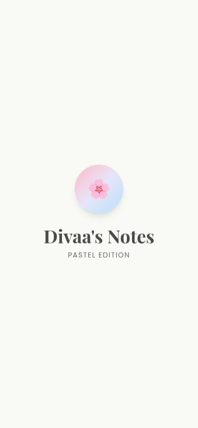
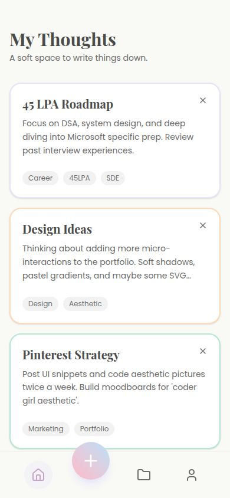
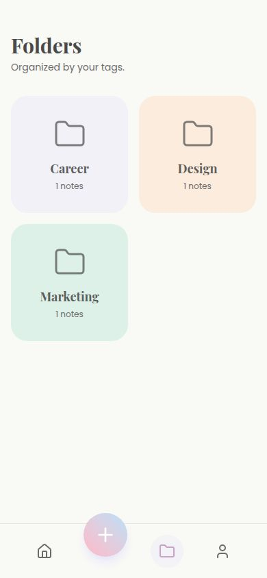
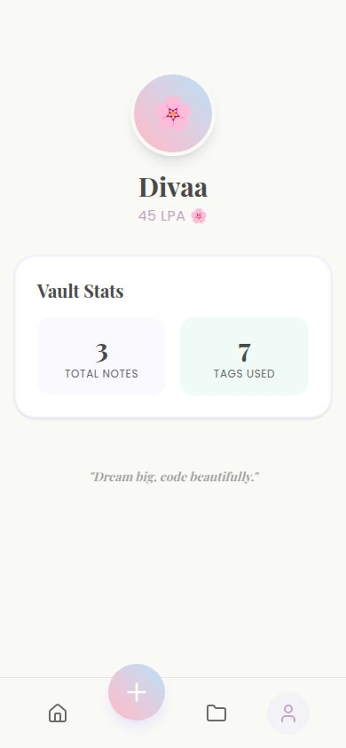

# Pastel-Notes-app-
# Divaa's Notes - Pastel Aesthetic Edition 🌸

**Live Demo:** https://riya3-collab.github.io/Pastel-Notes-app-/

## 🎨 App Screens
### 1. Splash Screen

### 2. Home - Notes Vault  

### 3. Folders Tab

### 4. Sign In Tab

## ✨ Features
- Splash Screen with floating animation
- Bottom Navigation: Home | Create | Folders | Sign In  
- Pastel Color System: Lavender #E6E6FA | Peach #FFDAB9 | Mint #B5EAD7
- Sparkle delete animation ✨
- Glassmorphism cards + Soft shadows
- Mobile-first responsive

## 🛠️ Tech Stack
Python HTML Generator → Vanilla CSS → Vanilla JS → Replit Deploy

## 🎯 45 LPA Roadmap
V1: Login UI ✅ | V2: Notes Vault ✅ | V3: Navigation ✅ | V4: Pastel Theme ✅
V5 Next: Full CRUD + LocalStorage

#UIDesign #WebDev #Aesthetic #WomenInTech #Python #MicrosoftSDE #100DaysOfCode
